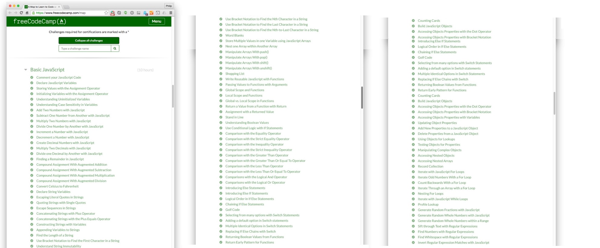

freeCodeCamp is an online community in support of teaching people to code.  Within their website, they offer various tutorials that include learning to write code using Java Script.  Towards this end, I complete their course on Basic Java Script.

I enjoyed these lessons because it was self paced and there was time to adequately complete them all.  Additionally, in this format, we were able to repeat lessons and review our previously saved code to esure that we had adequate understanding.  When one was to get stuck on a problem that was particularly difficult, it was nice that many of the pages had links to helpful hints that would guide you along.  In the worst case senerio, there was also a link to a forums page where you could post questions.  (Thankfully, I never needed to use this feature!)
 
<a href="https://www.freecodecamp.org/">freeCodeCamp</a>
