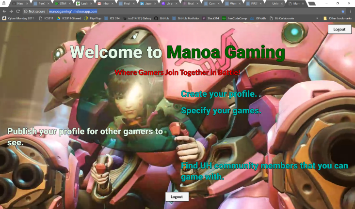
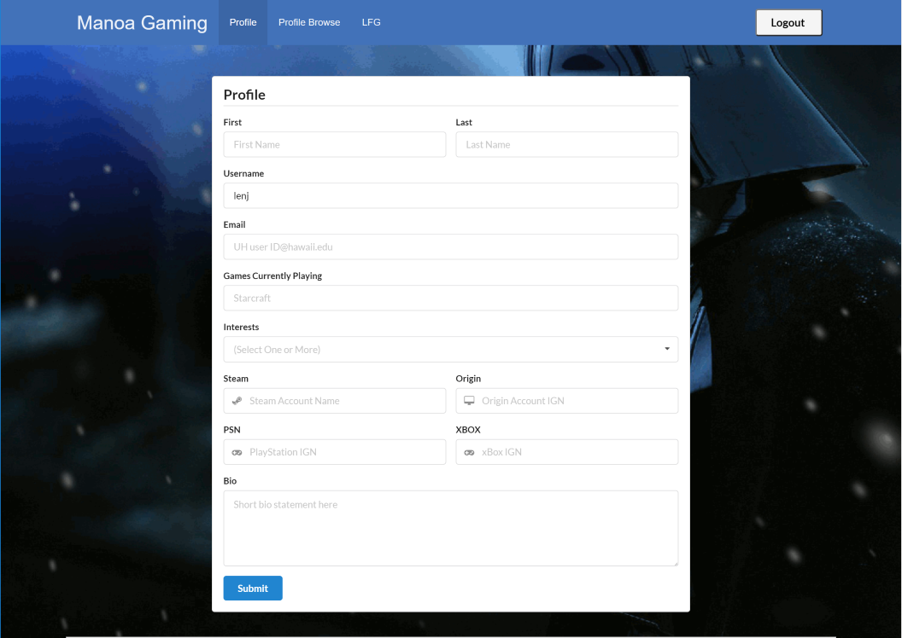

<h1> ICS 314 Project - Manoa Gaming </h1>
As a part of my studies in pursuit of a BS in Informational and Computer Sciences, during the fall of 2017, I enrolled in ICS 314 (Software Engineering 1).  The final project for this class was a group project.  For this project, my group chose to design a web application that would allow gamers from the University of Hawaii community to find other like-minded people and  to hook up and play games.  We called this website, <a href="https://manoagaming1.meteorapp.com/</a> ManoaGaming1.
<h2> My Role </h2>

Within this groups project, I had two major roles.  One of the roles was chosen and the other one was thrust upon me.  In an attempt to split the project responsibilities, I chose to work on the Profile Page.  On the other hand, due to our group having a interesting composition where three of the members requested to work together and a fourth member who was randomly assigned.  To complicate matters two out of the four members of the groups were extremely quiet.  This along with various other reasons, I some how got stuck in the role of the Group Leader.
<h2> Profile Page </h2>
Within our web application, we designed a profile page which would allow the users of the site to be able to create a local profile that would include their contact information and their interest and gaming habits.  Initially, I believed that I had the entire page programmed and working.  Unfortunately, it is at that point where I encountered an error with our site.  The error was that I could no longer login.  After hours of trouble shooting, I was still unable to determine the cause of this error.  Moreover, because it did not appear that any of the other members of our group were having problems with this error, I was led to believe that the error was within my branch (the work I had done.)  Because of this, I began my work all over again from the beginning and testing out the results as I finished each section.  This time, since I had been testing along the way and everything was still working, I pushed (uploaded) my commit (work) and merged it to the master branch (I sent it to everyone to use as a finished product.)  Unfortunately, the next day two of my group member messaged me that after using my project, they were now having the login problems and because I was initially the one who encountered this issue and because I had just sent out my project for everyone to use, I was once again lead to believe that I had somehow crashed our entire site.  I once again attempted to trouble shoot, I eventually determined that this error only appeared after resetting the database (when you started from scratch).  Even with this new information, my group and I were unable to determine the cause of this issue.  (Even with the help of a few other, we still had no luck.)  In a final attempt to trouble shoot this issue, I then had the unfortunate task of starting all over and reprogramming each line of code and retesting by restarting our database each time.  The worst part about that is that resetting and restarting the database and our application takes around 5 minutes each time.  Ironically, after all this time, stress and extra effort, this last attempt at trouble shooting finally turned up what was causing the login error.  It actually was a design problem that another group member made to the page and had nothing to do with what I had programmed.  If nothing else, at least I had now finished the profile page and it was working!  
<h2>Project Manager</h2>
As mentioned above, our groups

<a href="https://manoagaming.github.io/">Project Source</a>
---
layout: project
type: project
image: images/ManoaGamingLanding.png
title: Manoa Gaming
permalink: 
date: 2017
labels:
  - Meteor
  - Group Work
  - GitHub
  - Web Design
summary: 
---

<h1> ICS 314 Project - Manoa Gaming </h1>
As a part of my studies in pursuit of a BS in Informational and Computer Sciences, during the fall of 2017, I enrolled in ICS 314 (Software Engineering 1).  The final project for this class was a group project.  For this project, my group chose to design a web application that would allow gamers from the University of Hawaii community to find other like-minded people and  to hook up and play games.  We called this website, <a href="https://manoagaming1.meteorapp.com/</a> ManoaGaming1.
<h2> My Role </h2>

Within this groups project, I had two major roles.  One of the roles was chosen and the other one was thrust upon me.  In an attempt to split the project responsibilities, I chose to work on the Profile Page.  On the other hand, due to our group having a interesting composition where three of the members requested to work together and a fourth member who was randomly assigned.  To complicate matters two out of the four members of the groups were extremely quiet.  This along with various other reasons, I some how got stuck in the role of the Group Leader.
<h2> Profile Page </h2>
Within our web application, we designed a profile page which would allow the users of the site to be able to create a local profile that would include their contact information and their interest and gaming habits.  Initially, I believed that I had the entire page programmed and working.  Unfortunately, it is at that point where I encountered an error with our site.  The error was that I could no longer login.  After hours of trouble shooting, I was still unable to determine the cause of this error.  Moreover, because it did not appear that any of the other members of our group were having problems with this error, I was led to believe that the error was within my branch (the work I had done.)  Because of this, I began my work all over again from the beginning and testing out the results as I finished each section.  This time, since I had been testing along the way and everything was still working, I pushed (uploaded) my commit (work) and merged it to the master branch (I sent it to everyone to use as a finished product.)  Unfortunately, the next day two of my group member messaged me that after using my project, they were now having the login problems and because I was initially the one who encountered this issue and because I had just sent out my project for everyone to use, I was once again lead to believe that I had somehow crashed our entire site.  I once again attempted to trouble shoot, I eventually determined that this error only appeared after resetting the database (when you started from scratch).  Even with this new information, my group and I were unable to determine the cause of this issue.  (Even with the help of a few other, we still had no luck.)  In a final attempt to trouble shoot this issue, I then had the unfortunate task of starting all over and reprogramming each line of code and retesting by restarting our database each time.  The worst part about that is that resetting and restarting the database and our application takes around 5 minutes each time.  Ironically, after all this time, stress and extra effort, this last attempt at trouble shooting finally turned up what was causing the login error.  It actually was a design problem that another group member made to the page and had nothing to do with what I had programmed.  If nothing else, at least I had now finished the profile page and it was working!  
<h2>Project Manager</h2>
As mentioned above, our groups

<a href="https://manoagaming.github.io/">Project Source</a>
