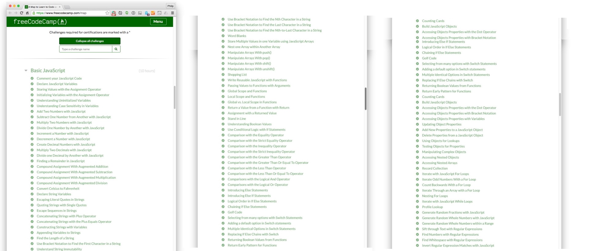

freeCodeCamp is an online community in support of teaching people to code.  Within their website, they offer various tutorials that include learning to write code using Java Script.  Towards this end, I complete their course on Basic Java Script.
 
<a href="https://www.freecodecamp.org/">freeCodeCamp</a>
